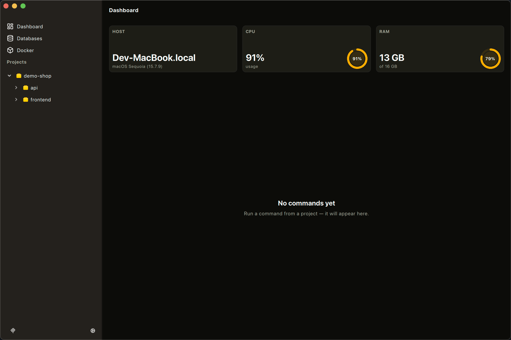
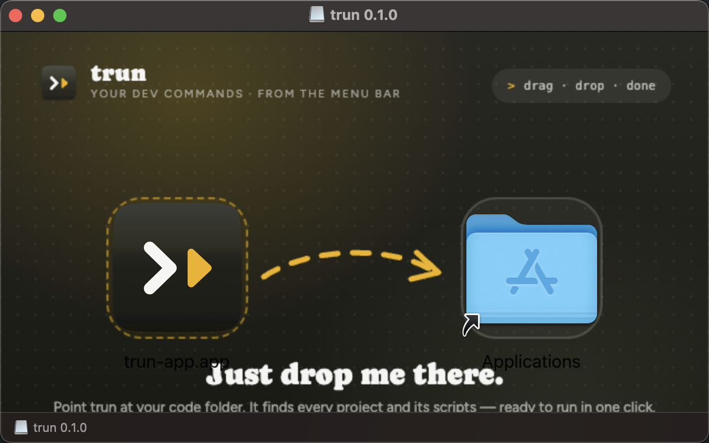

# trun

Run all your dev commands from the menu bar. Point trun at your code folder — it finds every project and its scripts, ready to launch in one click.



## Why

A typical dev setup means a terminal tab per project: `npm run dev` here, `composer serve` there, migrations somewhere else — every morning, in the right order, in the right folders. trun replaces that ritual with one tray icon: it scans your code folder, detects projects (`package.json`, `composer.json`, `Cargo.toml`, `go.mod`, …) and their commands, and lets you run, stop and inspect any of them without touching a terminal.

## Features

- **Project auto-detection** — drop in a root folder, trun recursively finds manifests and lists every runnable command, grouped by project.
- **Menu-bar control** — run/stop commands from the tray; pin favorites so they are always one click away.
- **Per-command console** — stdout/stderr is kept per command across reruns; open a command's detail page to see live output, CPU/RAM and detected ports.
- **Run configurations** — override executable, args, workdir, env or allow-multiple per command.
- **Leave running** — quit the app and keep servers alive; on next start trun reattaches to them automatically.
- **Databases & Docker** — start local Postgres/MySQL/Mongo/Redis and inspect Docker containers from the sidebar.
- **MCP server for AI agents** — `trun-app --mcp` exposes projects, commands, run controls and logs over MCP/stdio, so coding agents can run your stack themselves.
- **In-app updates** — trun checks GitHub Releases and installs new versions with one restart.

## Install (macOS)

1. Download `trun-<version>-macos-arm64.dmg` from [Releases](https://github.com/maxvanceffer/trun/releases).
2. Open it and drag `trun-app` into **Applications**.



> The app is not notarized yet (no Apple Developer certificate), so on first launch macOS may warn that the developer is unverified — right-click → **Open** to run it anyway.

## Usage

1. On first launch the wizard asks for your code folder, scans it and shows everything found.
2. Press **Run** on any command card — or pin it to get Run/Stop actions in the tray menu.
3. Click a card to open the detail page: live console, CPU/RAM stats, Run/Stop.
4. Check for updates any time via the gear button in the sidebar footer.

## Build from source

Requires Qt 6.5+ (Quick, QuickControls2, Widgets, Svg, Network) and CMake 3.16+.

```bash
cmake -S . -B build -DCMAKE_BUILD_TYPE=Release
cmake --build build --config Release --target trun-app
# dev run:
./build/trun-app.app/Contents/MacOS/trun-app
```

Tests:

```bash
cmake --build build --target test_updater test_commandexecutor test_mcpagents test_mcpserver test_projectservice
./build/test_updater
```

A new version is cut by pushing a tag — `git tag v0.2.0 && git push origin v0.2.0` — the [release workflow](.github/workflows/release.yml) builds a signed `.app`, packs `.dmg` + `.zip` and publishes them on GitHub Releases.

## License

MIT — see [LICENSE](LICENSE).
